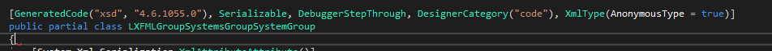

# LXF Part List Creator Tool

## Introduction

This tool takes `.lxf`-files -which are [LDD](http://ldd.lego.com) project files- and generates a brick/part list as html document.
In essence, `.lxf`-files are zip-compressed archives, which contain a `.lxfml` model file (XML) and a `.png`-thumbnail.


// TODO : insert more bla bla bla

## Usage

A html brick list can be generated as follows:
```bash
$ LXFPartListCreator.exe --in="/path/to/my/model.lxf" --out="/path/to/partlist.html"
```
If the tool should open the generated document, use the option `--open-after-success`

---
_Whatever you do, do **not** generate `.cs`-files with Microsoft's `xsd`-tool:_



_LXFMLGroupSystemsGroupSystemGroup - really?_
